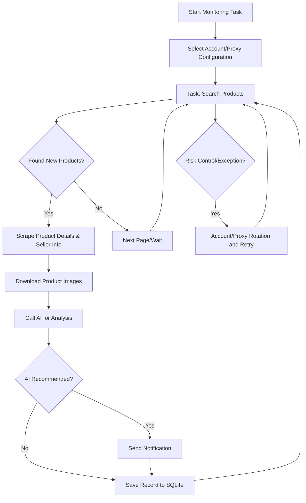

# xianyu-tools / Xianyu Toolbox

[中文](README.md) ｜ [English]

A Playwright and AI-powered multi-task toolbox for Xianyu (闲鱼), featuring real-time monitoring and a complete web management interface.

## Fork Differences

This repository is `xianyu-tools / Xianyu Toolbox`, maintained as a fork of upstream `ai-goofish-monitor`. The default Docker Compose setup builds `xianyu-tools:local` from the local source tree so fork-only functionality is present. The upstream published image `ghcr.io/usagi-org/ai-goofish:latest` does not include, or does not guarantee, these fork-only changes.

- **Backend and runtime**: Keeps the FastAPI + Vue + Playwright + SQLite runtime shape, preserves the compatible `scrape_xianyu(task_config, debug_limit)` entry point, and uses a strangler-style gradual refactor instead of a full rewrite.
- **Storage**: SQLite is the primary store for tasks, results, and price history. Legacy `config.json`, `jsonl/`, and `price_history/` data can still be imported for compatibility.
- **Notifications**: Keeps WeCom App, Telegram, and generic Webhook support. The Web UI can write `.env`. Legacy `ntfy`, Bark, WeChat bot, and Gotify settings are retained only as compatibility / ignored fields and are no longer active notification channels.
- **Task and search filters**: Restores and wires through `yhb_only` / YHB inspection filtering. Search filters include free shipping, personal seller, publish time, region, and price. The task form is split into collapsible groups.
- **Result filters**: The results page and CSV export share the same YHB, free-shipping, and AI `seller_type` personal-seller semantics, so exports match the visible filtering rules.
- **Accounts and runtime stability**: Supports account and proxy rotation, task-account binding, and failure retry. `failure_guard` detects cookie changes with a fingerprint (`mtime_ns`, `size`, `sha256`) so task recovery does not depend on file `mtime` moving forward.

## Core Features

- **Web Visual Management**: Task management, account management, AI criteria editing, run logs, results browsing
- **AI-Driven**: Natural language task creation, multimodal model for in-depth product analysis
- **Multi-Task Concurrency**: Independent configuration for keywords, prices, filters, and AI prompts
- **SQLite as Primary Storage**: Tasks, results, and price history are persisted in one embedded database instead of repeatedly scanning `jsonl`
- **Advanced Filtering**: Free shipping, YHB inspection, AI personal-seller persona, new listing time range, province/city/district filtering
- **Instant Notifications**: Supports WeCom App, Telegram, and advanced Webhook compatibility
- **Scheduled Tasks**: Cron expression configuration for periodic tasks
- **Account & Proxy Rotation**: Multi-account management, task-account binding, proxy pool rotation with failure retry
- **Docker Deployment**: One-click containerized deployment

## Screenshots


## Quick Start

### Requirements

- Python 3.10+
- Node.js + npm (`Node v20.18.3` has been verified to complete the frontend build)
- Playwright CLI and Chromium. Before the first local run, install them with `python3 -m pip install playwright && python3 -m playwright install chromium`
- Chrome or Edge on desktop systems. On Linux, Chromium also works. `start.sh` checks this prerequisite before continuing

```bash
git clone https://github.com/chqchshj/ai-goofish-monitor xianyu-tools
cd xianyu-tools
cp .env.example .env
```

### Minimum Configuration

- `OPENAI_API_KEY`: AI model API key, required.
- `OPENAI_BASE_URL`: OpenAI-compatible API base URL, required.
- `OPENAI_MODEL_NAME`: model name with image input support, required.
- `WEB_USERNAME` / `WEB_PASSWORD`: Web UI login credentials, default `admin/admin123`, optional.

See "Configuration" below for the rest.

### Start Locally

```bash
chmod +x start.sh
./start.sh
```

`start.sh` first validates the Playwright CLI and browser prerequisites. Once they are available, it installs project dependencies, builds the frontend, copies the artifacts, and starts the backend.

### First-Time Setup

1. Open the default Web UI at `http://127.0.0.1:8000` and sign in.
2. Go to "Xianyu Account Management" and use the [Chrome Extension](https://chromewebstore.google.com/detail/xianyu-login-state-extrac/eidlpfjiodpigmfcahkmlenhppfklcoa) to export and paste the Xianyu login-state JSON.
3. Login-state files are stored in `state/`, for example `state/acc_1.json`.
4. Go back to "Task Management", create a task, bind an account if needed, and run it.

### Create Your First Task

- `AI mode`: fill in the requirement description. Submission opens a separate progress dialog while the criteria are generated asynchronously.
- `Keyword mode`: provide keyword rules and the task is created immediately.
- `Region filter`: now uses a province / city / district selector backed by an embedded Xianyu page snapshot instead of manual text input.

## 🐳 Docker Deployment (Recommended)

```bash
git clone https://github.com/chqchshj/ai-goofish-monitor xianyu-tools && cd xianyu-tools
cp .env.example .env
vim .env # fill in the required values
docker compose up -d
docker compose logs -f app
docker compose down
```

- Default Web UI: `http://127.0.0.1:8000`
- The default `docker-compose.yaml` builds the local `xianyu-tools:local` image from this source tree, so fork-local changes such as WeCom application messages, task-level notification targets, and YHB/free-shipping/personal-seller result filters are included.
- The Docker image includes Chromium, so no extra browser install is required on the host.
- Update the local image: `docker compose up --build -d`
- If you switch to the upstream published image `ghcr.io/usagi-org/ai-goofish:latest`, note that it may not include this repository's fork-only features.
- If you change `SERVER_PORT` in `.env`, update the `ports` mapping in `docker-compose.yaml` as well.
- `docker-compose.yaml` now mounts the primary SQLite database directory as `./data:/app/data`, with the default database file at `data/app.sqlite3`
- These paths are persisted by default:
  - `data/` for the SQLite primary store (tasks, results, price history)
  - `state/` for login-state cookie files
  - `prompts/` for task prompt files
  - `logs/` for runtime logs
  - `images/` for downloaded product images and per-task temporary image folders
  - `config.json`, `jsonl/`, and `price_history/` as legacy sources for the first SQLite migration

### Storage and Migration

- SQLite is now the online primary storage, with the default path `data/app.sqlite3`
- You can override the database path with `APP_DATABASE_FILE`; Docker sets it to `/app/data/app.sqlite3`
- On startup, the app initializes the schema and tries to import existing data once from legacy `config.json`, `jsonl/`, and `price_history/`
- `state/`, `prompts/`, `logs/`, and `images/` remain filesystem-based and are not stored in SQLite
- Product images are temporarily downloaded to `images/task_images_<task_name>/` and are normally cleaned up when the task finishes
- After the first upgrade and after verifying the database contents in `data/app.sqlite3`, you can decide whether to keep the legacy `config.json`, `jsonl/`, and `price_history/` mounts

## User Guide

<details>
<summary>Click to expand Web UI usage notes</summary>

### Task Management

- The task form is grouped into collapsible sections for basic info, decision mode, search filters, schedule/account, and notification targets.
- Supports AI creation, keyword rules, price range, new listing filters, free shipping, YHB inspection, region filters, account binding, and cron scheduling. `yhb_only` stays consistent across task persistence, runtime config, and Xianyu search filtering.
- AI task creation runs as a background job and shows a dedicated progress dialog after submission.
- Region filtering can greatly reduce results, so leaving it empty is the safer default.

### Account Management

- Import, update, and delete Xianyu login states.
- Each task can bind a specific account or leave account selection to the system.

### Results and Logs

- The results page and export endpoints now query SQLite instead of directly scanning `jsonl` files.
- The results page and CSV export support YHB, free-shipping, and personal-seller-only filters. The personal-seller filter uses the AI-produced `seller_type` persona; keyword-mode results or older records without that persona do not match it.
- The logs page is the first place to inspect login-state expiry, anti-bot issues, or AI call failures.

### System Settings

- View system status, edit prompts, and adjust proxy / rotation-related settings.

</details>

## Developer Guide

### Local Development

```bash
# backend
python -m src.app
# or
uvicorn src.app:app --host 0.0.0.0 --port 8000 --reload

# frontend
cd web-ui
npm install
npm run dev
```

- FastAPI initializes SQLite on startup and performs the one-time legacy import from `config.json/jsonl/price_history` when needed
- `spider_v2.py` now loads tasks from SQLite by default; JSON config is only used when `--config <path>` is passed explicitly
- The default local database path is `data/app.sqlite3`
- The Vite dev server proxies `/api`, `/auth`, and `/ws` to `http://127.0.0.1:8000`.
- `npm run build` writes directly to the repository root `dist/` through the Vite configuration.
- FastAPI serves `dist/index.html` and `dist/assets/` from the repository root.
- `./start.sh` prints the default app URL `http://localhost:8000` and API docs URL `http://localhost:8000/docs`.

### Validation

```bash
PYTEST_DISABLE_PLUGIN_AUTOLOAD=1 pytest
cd web-ui && npm run build
```

### Task Creation API

<details>
<summary>Click to expand API behavior</summary>

- `POST /api/tasks/generate`
  - `decision_mode=ai`: returns `202` with a `job`; the client should poll for progress.
  - `decision_mode=keyword`: returns the created task directly.
- `GET /api/tasks/generate-jobs/{job_id}`: fetch AI task-generation progress.
- `POST /auth/status`: validate Web UI credentials.

</details>

## Configuration

<details>
<summary>Click to expand common configuration items</summary>

### AI and Runtime

- `OPENAI_API_KEY` / `OPENAI_BASE_URL` / `OPENAI_MODEL_NAME`: required AI model settings.
- `PROXY_URL`: dedicated HTTP/SOCKS5 proxy for AI requests.
- `RUN_HEADLESS`: whether the scraper runs headless; keep it `true` in Docker.
- `SERVER_PORT`: backend port, default `8000`.
- `LOGIN_IS_EDGE`: use Edge instead of Chrome locally; Docker images do not bundle Edge and always run with Chromium.
- `PCURL_TO_MOBILE`: convert desktop item URLs to mobile URLs.

### Notifications

- `WECOM_APP_CORPID` / `WECOM_APP_SECRET` / `WECOM_APP_AGENTID` / `WECOM_APP_TOUSER`
- `TELEGRAM_BOT_TOKEN` / `TELEGRAM_CHAT_ID` / `TELEGRAM_API_BASE_URL`
- `WEBHOOK_*`

Tasks can use `notification_targets` for task-level routing: an empty list uses global defaults; task-level targets only support `wecom_app`, `telegram`, and `default`; a `wecom_app` recipient may be `@all` or `userid1|userid2`. Existing `NTFY_TOPIC_URL`, `GOTIFY_*`, `BARK_URL`, and `WX_BOT_URL` env values are not deleted automatically, but they are no longer valid notification channels.

### Proxy Rotation and Failure Guard

- `PROXY_ROTATION_ENABLED`
- `PROXY_ROTATION_MODE`
- `PROXY_POOL`
- `PROXY_ROTATION_RETRY_LIMIT`
- `PROXY_BLACKLIST_TTL`
- `TASK_FAILURE_THRESHOLD`
- `TASK_FAILURE_PAUSE_SECONDS`
- `TASK_FAILURE_GUARD_PATH`

See `.env.example` for the full list.

</details>

## Web Authentication

<details>
<summary>Click to expand authentication notes</summary>

- The Web UI uses a login page and validates credentials through `POST /auth/status`.
- After login, the frontend stores local auth state for route guards and WebSocket startup.
- The default credentials are `admin/admin123`; change them in production.

</details>

## 🚀 Workflow

The diagram below shows the core processing flow of a monitoring task. The main service runs in `src.app` and launches one or more task processes based on user actions or schedule triggers.



## FAQ

<details>
<summary>Click to expand FAQ</summary>

### Why does AI task creation take time?

In AI mode, the system generates analysis criteria before the task itself is created. This now runs as a background job with a separate progress dialog instead of blocking the task form.

### Why is the region filter optional by default?

Region filtering can sharply reduce result volume. Leave it empty if you want a broader market scan first.

### Why does the app say the frontend build artifacts are missing?

It means the repository root `dist/` directory is missing. Run `./start.sh`, or build the frontend in `web-ui/` and make sure the artifacts are generated in the root `dist/`.

### Why does `./start.sh` complain about missing Playwright or a browser?

The script performs a prerequisite check before installing project dependencies. Install the Playwright CLI and Chromium first, then make sure Chrome, Edge, or Chromium is available on the system and rerun `./start.sh`.

</details>

## Acknowledgments

<details>
<summary>Click to expand acknowledgments</summary>

This project referenced the following excellent projects during development. Special thanks to:

- [superboyyy/xianyu_spider](https://github.com/superboyyy/xianyu_spider)

Also thanks to LinuxDo contributors for script contributions:

- [@jooooody](https://linux.do/u/jooooody/summary)

And thanks to the [LinuxDo](https://linux.do/) community.

Also thanks to ClaudeCode/Gemini/Codex and other model tools for freeing our hands and experiencing the joy of Vibe Coding.

</details>


## Notices

<details>
<summary>Click to expand notice details</summary>

- Please comply with Xianyu's user agreement and robots.txt rules. Do not make frequent requests to avoid burdening the server or having your account restricted.
- This project is for learning and technical research purposes only. Do not use it for illegal purposes.
- This project is released under the [MIT License](LICENSE), provided "as is", without any form of warranty.
- The project authors and contributors are not responsible for any direct, indirect, incidental, or special damages or losses caused by the use of this software.
- For more details, please refer to the [Disclaimer](DISCLAIMER.md) file.

</details>

## Star History

[](https://www.star-history.com/#Usagi-org/ai-goofish-monitor&Date)
